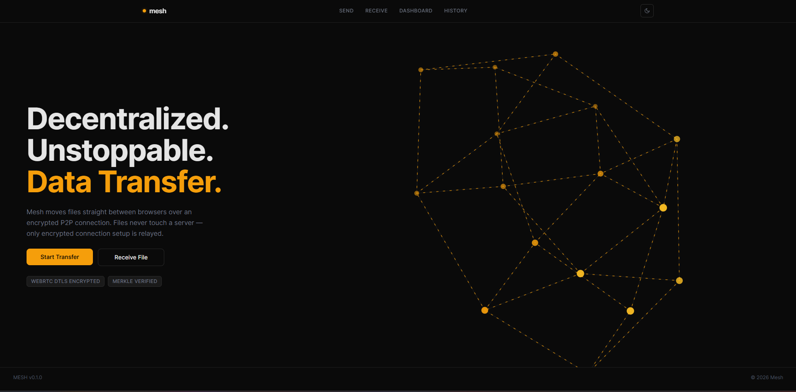
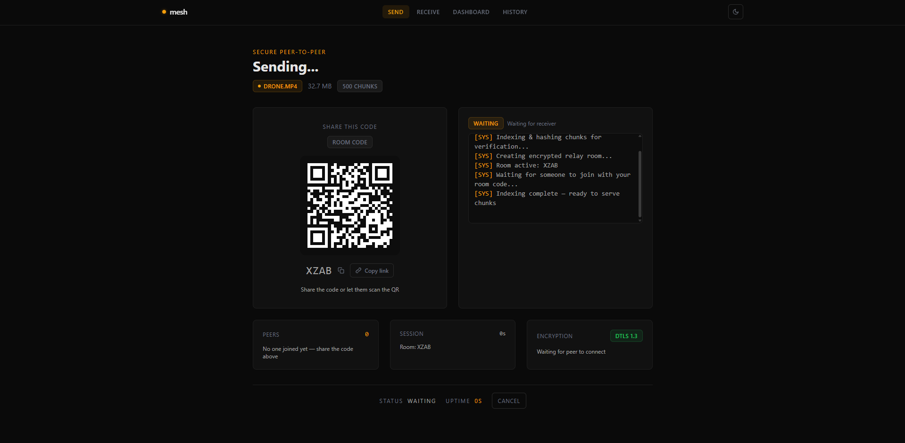
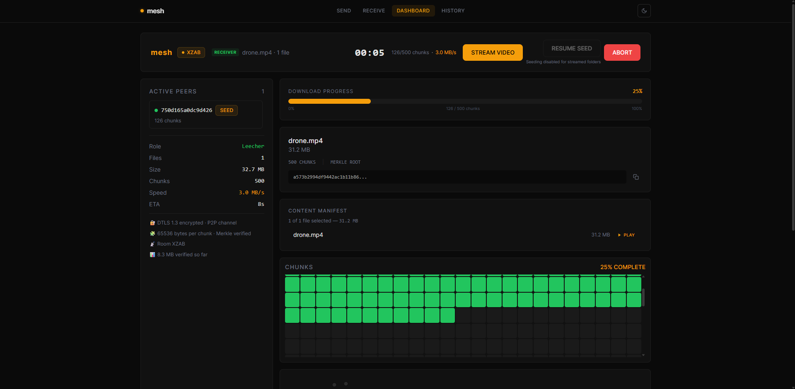
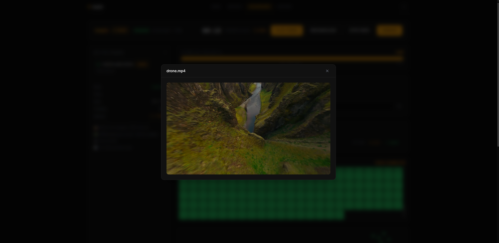
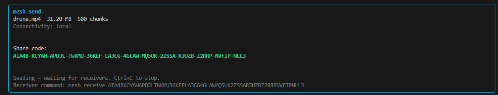
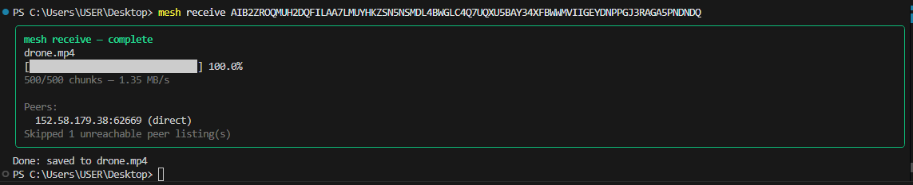
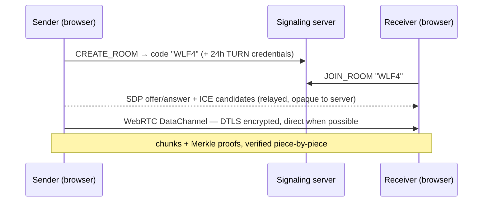
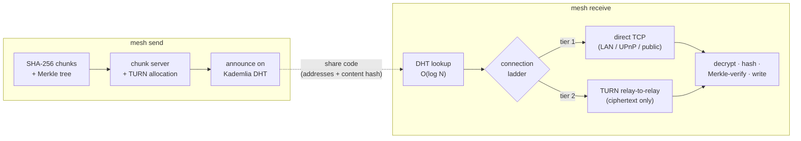

<div align="center">

# ⬡ mesh

**Serverless, end-to-end encrypted, peer-to-peer file sharing — in your browser *and* your terminal.**

Files travel machine-to-machine. No uploads. No accounts. No file ever touches a server.

[](https://www.npmjs.com/package/mesh-share)
[](https://mesh-share.vercel.app)
[](packages/cli/package.json)
[](packages/cli/package.json)
[](#-testing)
[](LICENSE)
[](#-contributing)

**[🌐 Try the web app](https://mesh-share.vercel.app)** · **[📦 `npm i -g mesh-share`](https://www.npmjs.com/package/mesh-share)** · **[🧠 How it works](#-how-it-works)**

</div>

---

## ✨ Two clients, one philosophy

> **Servers coordinate. Peers transfer.** The rendezvous infrastructure only ever sees tiny control messages; when a relay is unavoidable it forwards ciphertext it cannot read. File content exists on exactly two machines: yours and theirs.

|  | 🌐 **Web** — [mesh-share.vercel.app](https://mesh-share.vercel.app) | ⌨️ **CLI** — [`mesh-share` on npm](https://www.npmjs.com/package/mesh-share) |
|---|---|---|
| Share via | 4-letter room code + QR | Self-contained 84-char share code |
| Transport | WebRTC DataChannel (DTLS 1.3) | **From-scratch stack**: Kademlia DHT · STUN · TURN · reliable-UDP |
| Peer discovery | Room on signaling server | Distributed hash table (BitTorrent-style) |
| Encryption | DTLS (built into WebRTC) | X25519 ECDH → HKDF → AES-256-GCM (hand-wired) |
| Integrity | SHA-256 chunks + Merkle proofs | SHA-256 chunks + Merkle proofs |
| Install | nothing — open a tab | `npm install -g mesh-share` |

```
# the entire CLI experience:
you:          mesh send movie.mp4
              → AIB2Z-ROQMU-H2DQF-ILAA5-...

anyone, anywhere:  mesh receive AIB2ZROQMUH2DQFILAA5...
              → movie.mp4  ✔ 500/500 chunks verified
```

## 📸 Screenshots

<div align="center">

| | |
|---|---|
|  |  |
| *Landing page* | *Sending — share the code or the QR* |
|  |  |
| *Live transfer — chunk grid & speed* | *Watch a video **while** it downloads (MSE)* |
|  |  |
| *`mesh send` from a terminal* | *`mesh receive` — direct or relayed, always verified* |

</div>

## 🚀 Quick start

### Web
Open **[mesh-share.vercel.app](https://mesh-share.vercel.app)** → drop a file → share the code. That's it.

### CLI
```bash
npm install -g mesh-share

mesh send ./anything.zip        # zero flags — prints a share code
mesh receive <SHARE-CODE>       # on any machine, any network
mesh diagnose                   # what can your NAT do?
```

## 🧠 How it works

### The web client



### The CLI — a from-scratch P2P stack (zero runtime dependencies)



Every layer of the CLI's network stack is implemented by hand in [`packages/engine`](packages/engine):

- **Kademlia DHT** — XOR-metric routing, k-buckets, iterative `O(log N)` lookups, 90s liveness TTL ([`dht.js`](packages/engine/src/dht.js))
- **STUN client** — RFC 5389 binding, XOR-MAPPED-ADDRESS decoding ([`net/stun.js`](packages/engine/src/net/stun.js))
- **TURN client** — RFC 5766 allocations, permissions, HMAC credentials ([`net/turn.js`](packages/engine/src/net/turn.js))
- **UPnP** — SSDP discovery + SOAP port mapping ([`net/upnp.js`](packages/engine/src/net/upnp.js))
- **Reliable-UDP** — sliding-window ARQ with retransmit, reordering, backpressure ([`net/reliableDatagram.js`](packages/engine/src/net/reliableDatagram.js))
- **E2E crypto** — ephemeral X25519 → HKDF → AES-256-GCM per connection ([`crypto.js`](packages/engine/src/crypto.js))
- **Merkle verification** — every chunk ships a `log₂(N)`-hash proof chained to the share code's root
- **Multi-peer swarm** — up to 30 seeders, pipelined requests, misbehaving peers evicted after 5 strikes ([`swarm.js`](packages/engine/src/swarm.js))
- **Self-healing transfers** — retransmits back off exponentially through mobile-network stalls, and if every connection drops the receiver re-discovers peers via the DHT and continues from the last verified chunk ([`transfer.js`](packages/engine/src/transfer.js))
- **Pause/resume** — `Ctrl+C` checkpoints to a `.meshstate` sidecar; re-run the same command to continue

## 📊 By the numbers

| | |
|---|---|
| Runtime dependencies in the published CLI | **0** |
| Published package | **3 files, ~500 kB** (single esbuild bundle) |
| Automated tests across engine / CLI / signaling | **180+** (including a seeder killed and resurrected mid-transfer) |
| Connection tiers | direct TCP → TURN relay (hole-punch tier on the [roadmap](#-roadmap)) |
| Chunk size | adaptive **64 kB → 32 MB** (≤ ~50k chunks per file) |
| Merkle proof per chunk | `log₂(N)` hashes — ~300 bytes for a 500-chunk file |
| Largest real-world web transfer tested | **1.8 GB** (streamed to disk, no RAM blow-up) |
| Encryption | X25519 ECDH + HKDF-SHA256 + AES-256-GCM · DTLS 1.3 on web |

## 🗂 Monorepo

```
packages/
├── engine/      the from-scratch P2P stack (DHT, STUN, TURN, UPnP, reliable-UDP,
│                Merkle, swarm, resume) — zero dependencies, 19 test suites
├── cli/         `mesh` command — published to npm as mesh-share
├── signaling/   WebSocket rooms + TURN credential minting (Docker)
└── web/         React 19 + Vite + zustand client — deployed on Vercel
screenshots/     images used by the READMEs
docker-compose.yml   signaling + Caddy (TLS) + coturn — one command deploys the backend
```

## 🖥 Self-hosting the backend

Everything server-side runs from one compose file on any VM:

```bash
cp .env.example .env        # set EXTERNAL_IP, PRIVATE_IP, TURN_SECRET, TURN_REALM
docker compose up -d        # signaling + Caddy TLS + coturn (host networking)
nohup mesh daemon &         # DHT bootstrap node (or install it as a systemd unit)
```

Open these inbound ports: `80,443/tcp` (TLS), `8080/tcp` (signaling), `3478/udp+tcp` + `49160-49200/udp` (TURN), `4001/udp` (DHT bootstrap).
Point clients at your box with `--bootstrap <ip>:4001 --turn-host <ip> --turn-secret <secret>` or the `MESH_*` env vars — the defaults baked into the npm package are just a public courtesy instance.

> **Why does a P2P app have servers at all?** The same reason BitTorrent ships bootstrap routers and Tailscale runs DERP relays: something public must introduce two hidden machines, and when *both* peers are behind hostile NAT, physics requires a relay. Mesh's relay forwards ciphertext only, and every layer prefers a direct path first.

## 🧪 Testing

```bash
npm test                    # all workspaces
npm test -w packages/engine # loopback DHT meshes, swarm failure injection,
                            # TURN message encoding, resume, reliable-UDP
npm test -w packages/cli    # spawns the real binary end-to-end
```

180+ tests — including a network-blackout survival test and one that kills the only seeder mid-transfer, resurrects it, and asserts the file still arrives byte-identical — plus real-world verification: cross-continent transfers (India ↔ Azure), CGNAT and mobile-hotspot relay paths, and fresh-machine installs from the public registry.

## 🗺 Roadmap

- [ ] **UDP hole punching** for the CLI — direct NAT↔NAT connections with TURN as last resort (the web already gets this via ICE)
- [ ] Multiple default bootstrap nodes, raced in parallel
- [ ] Share-code v3: IPv6 candidates
- [ ] Skip the download entirely when the output file already matches the Merkle root ("you already have this file")
- [ ] AIMD congestion control in the reliable-UDP layer
- [ ] Authenticated key exchange bound to the share code

## 🤝 Contributing

Mesh is open source and PRs are welcome — the codebase is deliberately dependency-light and every protocol layer is readable in one sitting. Start with [`packages/engine/src/net/connect.js`](packages/engine/src/net/connect.js) (the connection ladder) to get oriented, run `npm test`, and open an issue or PR.

## 📄 License

[ISC](LICENSE) © Subhodeep Samanta
